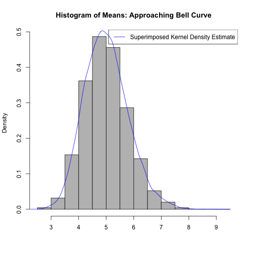

# Statistical Inference: Course Project
By <i><b>Nirmal Labh</b> [August 22, 2014]</i>

## Part 1: Simulation Exercise

We start off initializing a 20,000x40 matrix of exponential random samples with rate (lambda) of 0.2, each row representing a random sample of 40 observations:

```r
lambda <- 0.2
m <- 40
n <- 20000
expMatrix <- matrix(rexp((m*n), lambda) , nrow=n, ncol=m)
```
Next, we take the mean and standard deviation of each of the 20,000 samples:

```r
mean_per_sample  <- apply(expMatrix,1,mean)
sd_per_sample  <- apply(expMatrix,1,sd)
```
### 1. Show where the distribution is centered at and compare it to the theoretical center of the distribution.
Below are the calculated mean, followed by the theoritical mean (1/labmda):  

```r
me <- mean(mean_per_sample)
me
```

```
## [1] 5.005
```

```r
1/lambda
```

```
## [1] 5
```
### 2. Show how variable it is and compare it to the theoretical variance of the distribution.
Below are the variances for our sample mean(s), calculated one followed by the theoritical one:

```r
sd <- sd(mean_per_sample)
sd
```

```
## [1] 0.7965
```

```r
sd^2
```

```
## [1] 0.6345
```

```r
((1/lambda)/sqrt(m))^2
```

```
## [1] 0.625
```
### 3. Show that the distribution is approximately normal.

Here is a histogram of the sample means with the Kernel Density Estimator superimposed.
It is very easy to see the bell curve of the normal distribution our means are tending towards.


```r
# histogram of mean(s)
hist(mean_per_sample,freq=FALSE,xlab = "",col="gray",
     main = "Histogram of Means: Approaching Bell Curve")
lines(density(mean_per_sample),col='blue',type='l',lty=1,ylab='distribution values',
      main="Approaching Bell Curve",xlab='')
legend("topright", col = c("blue"),  c("Superimposed Kernel Density Estimate"),  lwd = 1) 
```

 
### 4.  Evaluate the coverage of the confidence intervali for 1/lambda:
[mean +/- 1.96*sd/sqrt(sample size)]

```r
ci_left  <- mean_per_sample - 1.96*sd_per_sample/sqrt(m)
ci_right <- mean_per_sample + 1.96*sd_per_sample/sqrt(m)
mean(ci_left < 1/lambda & ci_right > 1/lambda)
```

```
## [1] 0.9247
```
So, it appears that for about 92% of the simulated intervals the coverage is valid for the 95% Confidence Interval.
