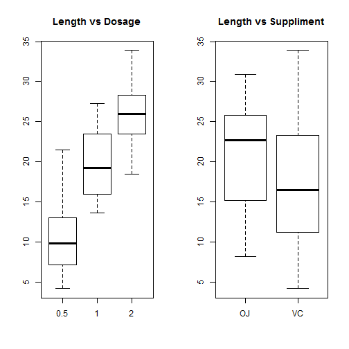

# Statistical Inference: Course Project 
By <i><b>Nirmal Labh</b> [August 22, 2014]</i> 
 
## Part 2: ToothGrowth: Data Analysis

### 1. Load the ToothGrowth data and provide a basic summary of the data: 

```r
# Loading the ToothGrowth data provided in the R dataset package
library(datasets) 
data(ToothGrowth) 
```

```r
par(mfrow = c(1, 2)) 
boxplot(len~dose, data=ToothGrowth, main="Length vs Dosage") 
boxplot(len~supp, data=ToothGrowth, main="Length vs Suppliment") 
```

 

It appears that effect of administering larger doses of vitamin C resulted in, on average, longer teeth. But, that does not say which method of administering the vitamin is more effective.

### 3. Use confidence intervals and hypothesis tests to compare tooth growth by supp and dose:

#### 3.1. Tooth Growth by Suppliment:

Average increased tooth length for the OJ group versus the VC group:

```r
OJTest <- ToothGrowth[ToothGrowth$supp=="OJ", "len"]
VCTest <- ToothGrowth[ToothGrowth$supp=="VC", "len"]
lengthChange=OJTest - VCTest 
```
The group treated with OJ has higher mean length of 20.6633 vs the VC group having the mean of about 16.9633. Does that mean administering OJ makes average tooth growth bigger?

Setting up the null and alternate hypotheses: <b>Ho:</b> lengthChange=0 VS. <b>Ha:</b> lengthChange>0


```r
lower_bound_ci=mean(lengthChange) - 1.96*sd(lengthChange)/sqrt(length(lengthChange))
upper_bound_ci=mean(lengthChange) + 1.96*sd(lengthChange)/sqrt(length(lengthChange))
```

The confidence interval (1.5041,5.8959) does not include 0 - the mean length change for null hypothesis. So, we reject the null hypothesis. Thus, at 95% confidence level, it is plausible that the tooth growth by OJ is larger than VC. 

#### 3.2. Tooth Growth by Dose:

##### Tooth Growth by Suppliment when dosage is (0.5,1):

```r
lowOJ <- ToothGrowth[ToothGrowth$supp=="OJ" & ToothGrowth$dose %in% c(0.5,1),"len"] 
lowVC <- ToothGrowth[ToothGrowth$supp=="VC" & ToothGrowth$dose %in% c(0.5,1),"len"]
```
Confidence interval and test the hypothesis: 

```r
alpha<-0.05; 
tt<-t.test(lowOJ,lowVC); #tt
```

For t>0, confidence interval limits >0, <b>Ho:</b>meanOfOJ = meanOfVC VS. <b>Ha</b>: meanOfOJ > meanOfVC

Ho is rejected, because TS(t = 3.0503) > qt(1-alpha,36.5531)( = 1.6876). 

##### Tooth Growth by Suppliment when dosage is 2:

```r
highOJ<- ToothGrowth[ToothGrowth$supp=="OJ" & ToothGrowth$dose==2,"len"] 
highVC<- ToothGrowth[ToothGrowth$supp=="VC" & ToothGrowth$dose==2,"len"]
tt<-t.test(highOJ,highVC); #tt
```
t<0, test the hypothes: <b>Ho:</b>meanOfOJ = meanOfVC versus <b>Ha:</b> meanOfOJ < meanOfVC

Ho is rejected, because TS(t = -0.0461) < qt(1-alpha,14.0398)( = 2.1442). 
 
### 4. State your conclusions and the assumptions needed for your conclusions:

By 95% confidence interval, for doses 0.5 or 1, tooth growth by OJ is larger than by VC. 
For larger dosage of 2, tooth growth by OJ is smaller than by VC .
