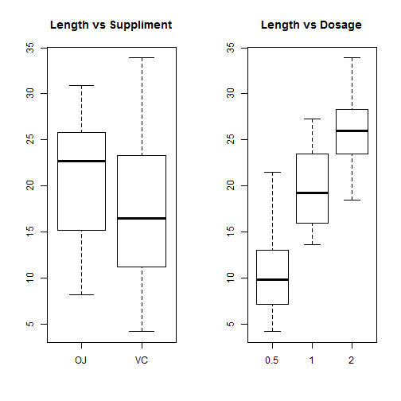
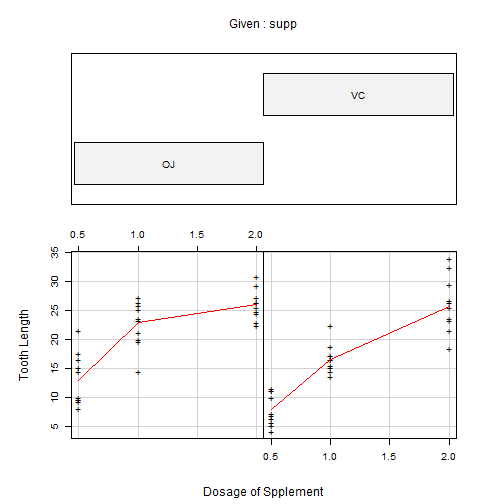

# Statistical Inference: Course Project 
By <i><b>Nirmal Labh</b> [August 22, 2014]</i> 
 
## Part 2: ToothGrowth: Data Analysis


### 1. Load the ToothGrowth data and perform some basic exploratory data analyses 

```r
# Loading the ToothGrowth data provided in the R dataset package
library(datasets) 
data(ToothGrowth) 
dim(ToothGrowth)
```

```
## [1] 60  3
```

```r
head(ToothGrowth,2) 
```

```
##    len supp dose
## 1  4.2   VC  0.5
## 2 11.5   VC  0.5
```

### 2. Provide a basic summary of the data:

The data has two levels for the suppliment given at three different levels of dosage:

```r
unique(ToothGrowth$supp)
```

```
## [1] VC OJ
## Levels: OJ VC
```

```r
unique(ToothGrowth$dose)
```

```
## [1] 0.5 1.0 2.0
```

```r
summary(ToothGrowth$dose)
```

```
##    Min. 1st Qu.  Median    Mean 3rd Qu.    Max. 
##    0.50    0.50    1.00    1.17    2.00    2.00
```

```r
par(mfrow = c(1, 2)) 
boxplot(len~supp, data=ToothGrowth, main="Length vs Suppliment") 
boxplot(len~dose, data=ToothGrowth,main="Length vs Dosage") 
```

 

```r
coplot(len~dose | supp, data = ToothGrowth, 
       pch = "+", panel = panel.smooth,
       xlab = "Dosage of Spplement",
       ylab = "Tooth Length") 
```

 

Visually it appears that effect of administering orange juice resulted in, on average, longer teeth when given given vitamin C. This is true only at the two lower dosage levels. At the highest dosage level it seems there is hardly any difference between the lengths of the teeth in the two groups, implying that beyond a certain threshold of dosage, type of supplement makes no difference.
 
### 3. Use confidence intervals and hypothesis tests to compare tooth growth by supp and dose:

#### 3.1. Tooth Growth by Suppliment:

Let's examine the point estimates for the average tooth length for the two groups of guinea pigs, 
one treated with Vitamin C and the ones treated with Orange Juice.


```r
VCTest<-ToothGrowth[ToothGrowth$supp=="VC","len"] 
OJTest<-ToothGrowth[ToothGrowth$supp=="OJ","len"] 
meanVC <- mean(VCTest)
meanOJ <- mean(OJTest)
meanVC
```

```
## [1] 16.96
```

```r
meanOJ
```

```
## [1] 20.66
```
Average increased tooth length when using Vitamin C:

```r
lengthChange=OJTest - VCTest
mean(lengthChange) 
```

```
## [1] 3.7
```
It seems that on an average the group treated with OJ seems to have a significantly higher mean length of around 20.6633 vs the other group 
having the mean of about 16.9633. Does that mean administering OJ makes average tooth growth bigger?

Setting up the null  and alternate hypotheses:  
   - <b>H<i>o</i>: lengthChange=3   </b>   
   - <b>H<i>a</i>: lengthChange<>3  </b>


```r
lower_bound=mean(lengthChange) - 1.96*sd(lengthChange)/sqrt(length(lengthChange))
upper_bound=mean(lengthChange) + 1.96*sd(lengthChange)/sqrt(length(lengthChange))
lower_bound
```

```
## [1] 1.504
```

```r
upper_bound
```

```
## [1] 5.896
```

```r
#tTest <- t.test(lengthChange,mu=3)
#tTest

# student T distribution quantile function
#qt(0.975,29) 
```
#The TS(t=0.6248) < qt(0.975,29) = (2.0452), p-value(=0.537)>0.05, so we fail to reject the null hypothesis. 

The confidence interval was calculated as (1.5041,5.8959), the mean length change of 3 falls in the range of plausible values, 
so we cannot say the null hypothesis is implausible.

So, at 95% confidence level, it is plausible that the tooth growth by OJ is larger than VC about 3 unit. 


#### 3.2. Tooth Growth by Dose:

```r
lengthChange2=ToothGrowth$len/ToothGrowth$dose 
mean(lengthChange2) 
```

```
## [1] 18
```
test the hypothesis: H0:lengthChange=17 versus Ha:lengthChange<>17 

```r
tTestDosage<-t.test(lengthChange2,mu=17); tTestDosage 
```

```
## 
## 	One Sample t-test
## 
## data:  lengthChange2
## t = 1.136, df = 59, p-value = 0.2605
## alternative hypothesis: true mean is not equal to 17
## 95 percent confidence interval:
##  16.24 19.76
## sample estimates:
## mean of x 
##        18
```

```r
qt(0.975,59) 
```

```
## [1] 2.001
```
the TS(t=1.1362) < qt(0.975,59)(=2.001), p-value(=0.2605)>0.05, so we fail to reject the null hypothesis.  

 
### 4. State your conclusions and the assumptions needed for your conclusions:

So, by 95%, tooth growth for one unit dose is a constance 17. 
